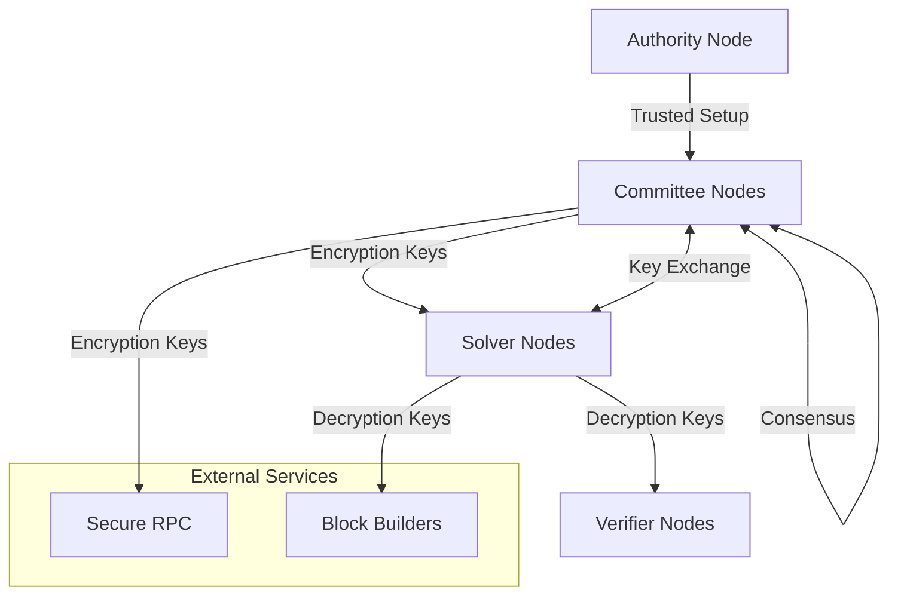
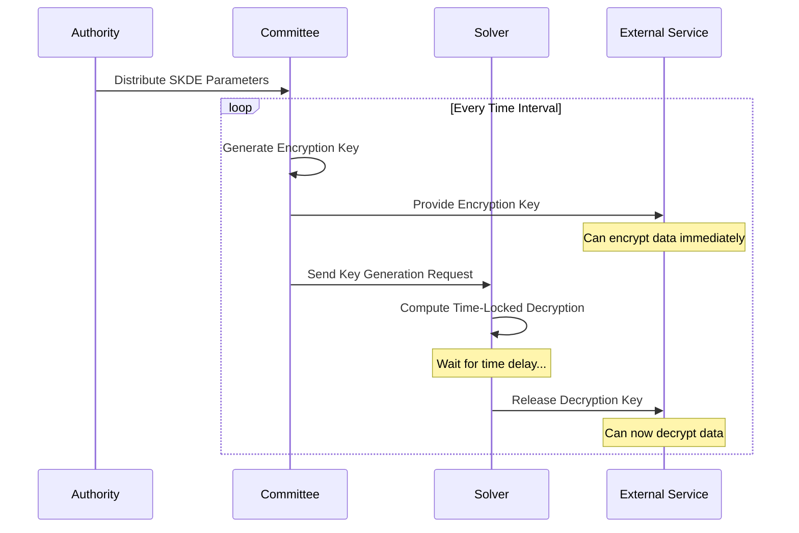
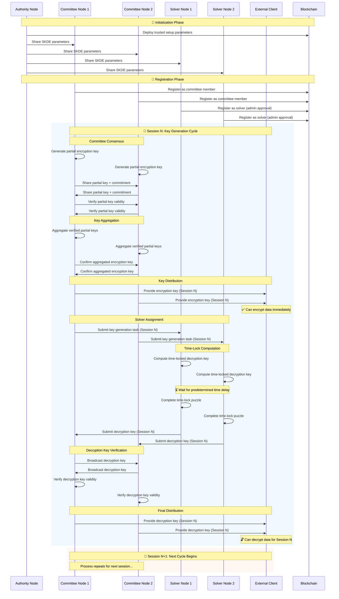
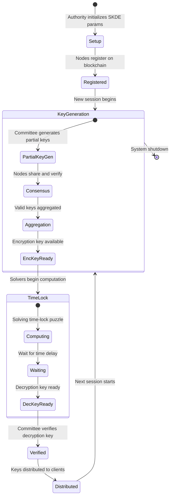

# 🔐 Distributed Key Generation

<div align="center">

[](https://github.com/radiusxyz/distributed_key_generator/actions)
[](https://opensource.org/licenses/MIT)
[](https://forge.rust-lang.org/)

**A secure, distributed key generation system for the Radius Block Building Solution**

[Documentation](https://github.com/radiusxyz/radius-docs-bbs) • [Contributing](https://github.com/radiusxyz/radius-docs-bbs/blob/main/docs/contributing_guide.md) • [Getting Help](https://github.com/radiusxyz/radius-docs-bbs/blob/main/docs/getting_help.md)

</div>

---

## 🌟 Overview

The Distributed Key Generator (DKG) is a critical component of the [Radius Block Building Solution](https://github.com/radiusxyz/radius-docs-bbs/blob/main/docs/radius_block_building_solution.md) that implements a secure, time-locked encryption/decryption mechanism.

### ✨ Key Features

- **🕒 Time-Locked Encryption**: Generates encryption keys immediately available, with decryption keys released after predetermined time intervals
- **🔗 Distributed Architecture**: Multiple node types work together to ensure security and availability
- **⚡ SKDE Integration**: Uses Shared Key Derivation Extension for cryptographic operations
- **🛡️ Byzantine Fault Tolerance**: Robust against malicious actors and network failures
- **🚀 High Performance**: Asynchronous task processing with efficient consensus mechanisms

## 🏗️ Architecture

The DKG system consists of four specialized node types that work together in a coordinated fashion:



### 🎭 Node Roles

| Role             | Purpose               | Responsibilities                                 |
| ---------------- | --------------------- | ------------------------------------------------ |
| **🏛️ Authority** | Trusted Setup Manager | Constructs and distributes SKDE parameters       |
| **👥 Committee** | Key Generation Leader | Generates encryption keys, coordinates consensus |
| **🧮 Solver**    | Decryption Provider   | Computes time-locked decryption keys             |
| **👁️ Verifier**  | Network Monitor       | Detects and reports Byzantine behavior           |

### 🔄 How It Works

The DKG system operates on a **time-locked encryption model**:

1. **Setup Phase**: Authority node generates and distributes SKDE parameters
2. **Key Generation**: Committee nodes create encryption keys for each time interval
3. **Immediate Access**: Encryption keys are immediately available to external services
4. **Time-Locked Release**: Solver nodes compute and release decryption keys after predetermined delays
5. **Verification**: Verifier nodes monitor the network for malicious behavior



## 🔄 Detailed Key Lifecycle

### Complete Key Generation Cycle



### Key States and Transitions



### 📋 Prerequisites

- **Rust Toolchain**: nightly-2024-10-24 (automatically managed via `rust-toolchain`)
- **System**: Linux/macOS (Windows support may require additional setup)

## 🚀 Quick Start

### 1. 🔨 Build the Project

```bash
# Clone the repository
git clone https://github.com/radiusxyz/distributed_key_generator.git
cd distributed_key_generator

# Build in release mode
cargo build --release
```

### 2. 🎯 One-Click Demo

For a complete demonstration, use our automated setup script:

```bash
# Start all nodes automatically
./scripts/execute/01_run_all_nodes.sh
```

This script will:

- Clean up any existing processes
- Build the project
- Start Authority, Committee, and Solver nodes in sequence
- Register nodes with each other

### 3. 🔧 Manual Setup (Step-by-Step)

#### Step 1: Create Trusted Setup Parameters

```bash
./target/release/dkg trusted-setup skde \
  --skde.generator 4 \
  --skde.time 1258291 \
  --skde.max-sequencer 2
```

#### Step 2: Run Authority Node

```bash
./target/release/dkg node \
  --dkg.role authority \
  --dkg.trusted-address 0x5FbDB2315678afecb367f032d93F642f64180aa3
```

#### Step 3: Run Committee Node

```bash
./target/release/dkg node \
  --dkg.role committee \
  --dkg.trusted-address 0x5FbDB2315678afecb367f032d93F642f64180aa3 \
  --internal.port 7100 \
  --external.port 7200 \
  --cluster.port 7300
```

#### Step 4: Run Solver Node

```bash
./target/release/dkg node \
  --dkg.role solver \
  --dkg.trusted-address 0x5FbDB2315678afecb367f032d93F642f64180aa3 \
  --internal.port 8100 \
  --external.port 8200 \
  --cluster.port 8300
```

#### Step 5: Register Nodes

```bash
./scripts/execute/06_register_nodes.sh
```

### 🌐 Port Configuration

| Service      | Port Range | Purpose                    |
| ------------ | ---------- | -------------------------- |
| Internal RPC | 7100-7199  | Node-to-node communication |
| External RPC | 7200-7299  | Client-facing API          |
| Cluster RPC  | 7300-7399  | Consensus and coordination |
| Solver RPC   | 8100-8199  | Solver-specific operations |

## 🧪 Testing

### Running Tests

Execute the comprehensive test suite:

```bash
# Run all tests (single-threaded required)
cargo test -- --test-threads=1

# Run specific integration tests
cargo test integration::run_single_node_for_each_role -- --test-threads=1

# Clean up hanging processes if needed
pkill -f key-generator
```

### Test Architecture

The testing infrastructure includes:

- **Integration Tests**: Multi-node scenarios in `tests/integration/`
- **Automated Setup**: Process spawning and cleanup utilities
- **Predictable Ports**: Consistent port allocation for reproducible tests

## 📚 Project Structure

```
distributed_key_generator/
├── cli/                    # Command-line interface
├── node/                   # Core node implementations
│   ├── primitives/         # Node configuration and services
│   ├── service/            # Task workers and main logic
│   ├── operator/           # Blockchain operator integration
│   └── key_generator/skde/ # SKDE key generation
├── primitives/             # Core types and consensus
├── rpc/                    # RPC handlers (cluster, external)
├── utils/                  # Shared utilities
├── scripts/execute/        # Node automation scripts
└── tests/                  # Integration tests and utilities
```

## 🛠️ Development

### Prerequisites for Development

```bash
# Install Rust nightly toolchain
rustup toolchain install nightly-2024-10-24
rustup default nightly-2024-10-24

# Format code
cargo fmt

# Lint code
cargo clippy
```

### Configuration System

The DKG uses a three-tier configuration priority:

1. **CLI Arguments** (highest priority)
2. **TOML Configuration Files** (`config.toml`)
3. **Default Constants** (fallback)

### Event System

The system implements a dual-channel event architecture:

- **SessionEvent**: Committee session lifecycle management
- **SolverEvent**: Solver-specific decryption operations
- **DkgEvent**: Unified event wrapper

## 🌟 Use Cases

### 🔒 Privacy-Preserving Applications

- **Sealed Bid Auctions**: Encrypt bids immediately, reveal after auction closes
- **Delayed Disclosure**: Time-locked revelation of sensitive information
- **Fair Exchange**: Ensure simultaneous release of data between parties

### 🏗️ Blockchain Infrastructure

- **MEV Protection**: Time-locked transaction ordering
- **Commit-Reveal Schemes**: Enhanced with cryptographic time locks
- **Decentralized Escrow**: Automatic release after time conditions

## 🤝 Contributing

We welcome contributions! Here's how to get started:

1. **Check Issues**: Visit our [issues page](https://github.com/radiusxyz/distributed_key_generation/issues)
2. **Read Guidelines**: Review our [Contributing Guide](https://github.com/radiusxyz/radius-docs-bbs/blob/main/docs/contributing_guide.md)
3. **Submit PRs**: Follow the standard GitHub workflow

### Development Workflow

```bash
# 1. Fork and clone
git clone https://github.com/your-username/distributed_key_generator.git

# 2. Create feature branch
git checkout -b feature/awesome-feature

# 3. Make changes and test
cargo test -- --test-threads=1
cargo fmt && cargo clippy

# 4. Submit PR
git push origin feature/awesome-feature
```

## 📞 Getting Help

- **Documentation**: [Radius Documentation](https://github.com/radiusxyz/radius-docs-bbs)
- **Issues**: Report bugs or request features on [GitHub Issues](https://github.com/radiusxyz/distributed_key_generation/issues)
- **Community**: Join our [Getting Help](https://github.com/radiusxyz/radius-docs-bbs/blob/main/docs/getting_help.md) resources

---

<div align="center">

**Built with ❤️ by the Radius Team**

[Website](https://theradius.xyz) • [GitHub](https://github.com/radiusxyz) • [Documentation](https://github.com/radiusxyz/radius-docs-bbs)

</div>
